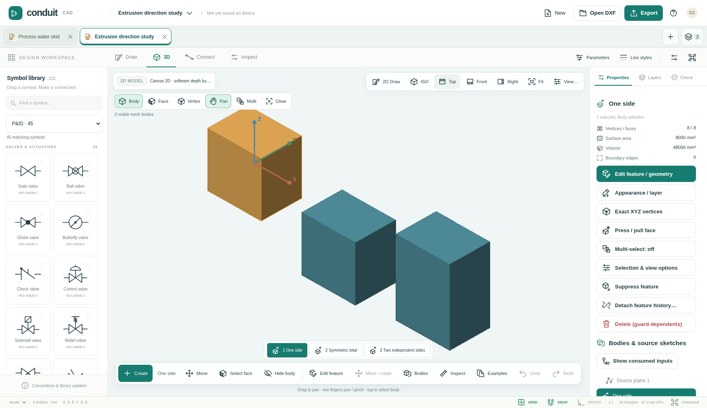

# Conduit CAD

**Touch-first, DXF-native 2D/3D CAD and diagramming — 0.9.1.**

A local-first HTML/JavaScript application with native CAD entities, engineering
symbol libraries, routed connectors, shared blocks, parametric sketches and a
faceted 3D feature engine. Desktop and mobile share the same document/history
model, with separate 2D and 3D cameras. Nineteen reusable ES-module packages power
the workbench; no third-party runtime packages or CDN assets are required.

## New: coherent desktop and touch iconography

180 original SVG UI glyphs now identify drawing tools, modeling operations,
selection modes, camera views, properties, dimensions, blocks, feature history,
document controls and export formats. **Adaptive**, **Icons and labels**, and
**Compact icons** modes retain accessible command names. Document titles, numeric
values, form labels and critical confirmations are not replaced by anonymous icons.

Open **More / Shapes → Icon guide**, or find the same controls in **3D Create**,
**3D View**, and **Help**. The guide is searchable; preferences are separate from
drawing data. The engineering symbols themselves have not been changed.



[Icon behavior and accessibility](docs/ICONOGRAPHY.md) ·
[Offline 180-glyph atlas](docs/icon-atlas.html) ·
[Mobile tools](artifacts/icons-390-tools.png) ·
[Validation and provenance](docs/VALIDATION_ICONOGRAPHY_091.md)

## Run

Open `dist/ConduitCAD.html` for the single-file application, or serve the production
`dist/` directory. Attachment previews may not execute JavaScript. For development,
use Node.js 22 or newer:

```sh
node scripts/bootstrap.mjs
npm test
npm run build
npm run dev
```

The development address is `http://localhost:4173`. Bootstrap links workspace
packages without contacting npm. Serve over HTTPS for the mobile GPU-capable path;
ordinary LAN HTTP must not be treated as secure-origin WebGPU validation. The
application reports the active renderer and any fallback reason.

`?renderer=canvas`, `?renderer=webgl2`, and `?renderer=webgpu` select a 2D backend.
Use `renderer3d` for the corresponding 3D selection. `?fresh=1` skips workspace
restoration without deleting saved data; `?no-sw=1` skips service-worker registration.
The standalone file does not register a service worker.

## Workflows

**Draw and connect.** On a phone, open Symbols, select a master, then tap to place.
Use its dedicated grab handle for drag-and-drop without fighting library scrolling.
Drag between ports or use Connect; routes update with connected equipment. More /
Shapes exposes native arcs, ellipses, splines, polygons, fills, construction lines,
text, leaders and dimension variants. Exact point entry supports Cartesian/polar
coordinates and parameter expressions. Two fingers navigate without placing geometry.

**Edit parametrically.** Properties, grips and exact-control tables operate on
native entities. Shared block geometry is edited in an isolated canvas; Save updates
references in one undoable transaction. Parameters/actions, sketch constraints,
driving dimensions and calculated text use validated expressions and atomic
regeneration. Test Block previews independent instance values.

**Model in 3D.** Switch to 3D or open a 3D starter. Create primitives, extrusions,
revolves, lofts, sweeps, booleans and patterns. Face selection exposes Sketch on face,
Hole, Press/Pull and Look at face. Holes support simple, counterbore and countersink
forms. Extrusions support one-sided, symmetric and two-sided extents, start offsets
and New Body/Join/Cut/Intersect. Preview is transient until Apply. The timeline
supports feature editing and upstream regeneration; 2D Draw returns to planar drafting.

**Keep multiple drawings open.** New/Open append documents instead of replacing
the active drawing. Tabs preserve undo history, cameras, selection, settings,
original DXF data and unfinished block drafts. The document switcher includes rename,
reorder, duplicate, close/save and recently closed recovery. Export downloads the
active drawing. Keep exported backups: browser recovery is not durable external storage.

Twenty schematic starters and thirteen 3D examples are editable native projects.
The 3D examples also have ASCII and binary DXF copies under `samples/3d/`.

## Engineering libraries and DXF

The catalogue contains 223 editable masters in eleven categories, plus 21 connection
styles: P&ID, electrical, flowcharts, instrumentation, hydraulics, pneumatics, HVAC,
water/plumbing, automation, fire-alarm topology and networks. Each master records its
reference family and review notes; this is **not blanket ISO/IEC/ISA certification**.
Library updates explicitly validate terminals before replacing used definitions.

Native project export preserves Conduit editing metadata. Normalized DXF rebuilds
supported entities/tables/layouts; record-preserving export retains original records
and applies only guarded safe edits. Original-file download returns the imported
bytes without edits. Supported exchanges include native DIMENSION graphics, MESH,
HELIX, WIPEOUT, OCS/XYZ geometry, hatch boundaries and paper layouts. SVG/PNG and
application-specific data exports remain available. Consult the compatibility matrix
before importing production files.

This is **not full AutoCAD/Fusion/Visio or universal DXF parity**. The 3D kernel is
faceted, not curved ACIS/B-rep, and does not author native `3DSOLID`. Proprietary
Autodesk action/association graphs are not evaluated. Face profiles are snapshots,
not fully associative sketches; font/Bigfont fidelity, external reference resolution
and complete paper plotting remain bounded. Unshifted two-color LINEAR hatch gradients
have a gradient preview; other retained distributions have documented limitations.

## Reusable packages

| Package | Responsibility |
|---|---|
| `@conduitcad/icons` | Original decorative SVG registry and immutable discovery data |
| `@conduitcad/geometry` | Planar double-precision geometry and curve evaluation |
| `@conduitcad/geometry3d` | Spatial vectors, transforms and curve geometry |
| `@conduitcad/spatial` | Packed BVH and incremental indexing |
| `@conduitcad/drawing` | Native construction factories and point sessions |
| `@conduitcad/model` | Document, entities, blocks and portable geometry |
| `@conduitcad/modeling` | Faceted 3D features, topology, booleans and regeneration |
| `@conduitcad/history` | Atomic transactions and bounded undo/redo |
| `@conduitcad/constraints` | Expressions and component-partitioned planar solving |
| `@conduitcad/routing` | Port-aware orthogonal routing and graphs |
| `@conduitcad/symbols` | Engineering masters, connection styles and starters |
| `@conduitcad/dxf` | Typed ASCII/binary readers, writers and preservation |
| `@conduitcad/renderer` | Retained 2D scene, camera and rendering backends |
| `@conduitcad/renderer3d` | Depth-aware spatial rendering, picking and navigation |
| `@conduitcad/input` | Mouse, pen, touch and wheel arbitration |
| `@conduitcad/workspace` | Independent document sessions and recovery coordination |
| `@conduitcad/storage` | Browser recovery and downloads |
| `@conduitcad/exchange` | SVG, PNG and application exchanges |
| `@conduitcad/workbench` | Responsive shell, tools, inspectors and dialogs |

```sh
npm run pack:packages
node scripts/verify-packages.mjs
npm run icons
```

Archives are in `artifacts/npm/`. They are prepared and tested, **not published to
npm**. `@conduitcad` is an implementation namespace, not an assertion of registry
ownership. Rename it to a controlled scope before registry publication. Unpublished
interdependent archives can be installed together with
`npm install /path/to/artifacts/npm/*.tgz`. Public TypeScript declarations accompany
the packages; DXF extension data remains permissively typed where documented.

## Validation and implementation notes

The 0.9.1 validation has 602 passing Node tests, inherited browser regressions and a
146-assertion icon suite, strict TypeScript consumers and clean offline integration
of all nineteen packages. Raw reports, screenshots and exact execution scope are
listed in [the current validation record](docs/VALIDATION_ICONOGRAPHY_091.md).
The permanent Pages workflow validates the production build and compares hosted
resource hashes after deployment.

Canvas software depth, WebGL2 and WebGPU API paths have fixture-level regression
coverage using SwiftShader. This is not physical GPU performance or universal pixel
equivalence. Emulated touch and keyboard tests are not physical iOS/Android, native
screen-reader or OS keyboard acceptance. Native IndexedDB/Web Locks recovery has a
separate suite; crash/eviction durability still requires independent qualification.

No MutationObserver, per-frame DOM scan, icon font or remote asset load is used for
iconography. Existing geometry, solver, DXF and rendering semantics are retained.
CPU-only benchmarks are labeled as such; they are not GPU completion timestamps or
mobile frame-rate guarantees. Large topology edits and snapshot history still incur
whole-document costs.

## Documentation and license

[DXF compatibility](docs/DXF_COMPATIBILITY.md) · [Drawing tools](docs/DRAWING_TOOLS.md) ·
[Parametric authoring](docs/PARAMETRIC_AUTHORING.md) · [3D modeling](docs/MODELING_3D.md) ·
[Face authoring](docs/AUTHORING_3D_090.md) · [Symbols](docs/SYMBOLS.md) ·
[Multi-document workflows](docs/MULTI_DOCUMENT.md) · [Mobile UI](docs/MOBILE_UI.md) ·
[API examples](docs/API.md) · [Release notes](RELEASE_NOTES.md)

`apps/studio` is the entry point, `packages` contains reusable components, `scripts`
contains build/sample tooling, `tests` contains validation, `samples` contains drawings,
and `dist` contains the prebuilt application. MIT licensed; see `LICENSE` and
`THIRD_PARTY_NOTICES.md`. Drawings are processed locally, without accounts, telemetry
or document uploads. Always retain exported project backups.
