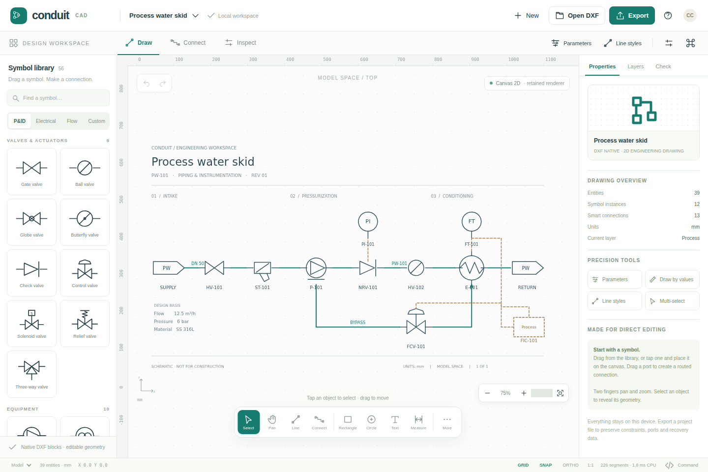

# Conduit CAD

**Touch-first, DXF-native 2D CAD and diagramming. Version 0.1.0.**

A working local-first HTML/JavaScript application with editable CAD entities,
ports, routed connectors, original P&ID / electrical / flow libraries, a planar
geometry kernel, parameter expressions and a small-sketch constraint solver.
WebGPU strokes and compute culling are implemented, with WebGL2 and Canvas 2D
fallbacks. The application is built from 13 independently packaged ES modules.

This is an engineering foundation, **not full AutoCAD, Visio, universal DXF,
or certified engineering-system parity**. Read [the exact compatibility
boundary](docs/DXF_COMPATIBILITY.md) before importing production drawings.



## Run immediately

Open `dist/ConduitCAD.html` in a modern browser for the single-file app. It has
no CDN dependencies, external fonts, network package loads or backend services.
An attachment preview inside a messaging application may not execute JavaScript;
open it in a browser, or use the served build below.

For the intended GPU-capable development path, use Node.js 22 LTS or newer:

```sh
node scripts/bootstrap.mjs
npm test
npm run build
npm run dev
```

Then open `http://localhost:4173`. The bootstrap links all local workspace
packages without contacting npm. No dependency install is needed. A normal
`npm install --offline --ignore-scripts` is also supported for the workspace.

`dist/` is a prebuilt static site. Serve it over **HTTPS** for a mobile browser.
The development server listens on all interfaces by default (`HOST` and `PORT`
are configurable). An ordinary LAN HTTP origin can exercise fallbacks, but
must not be treated as the secure-origin WebGPU test. WebGPU availability also
depends on browser, adapter and driver support. The active backend is visible
on the canvas; initialization failures automatically fall back.

Useful startup options: `?renderer=canvas`, `?renderer=webgl2`,
`?renderer=webgpu`, `?fresh=1` to skip loading the autosave, and `?no-sw=1` to
skip registration of the service worker. `fresh` does not delete saved data.
The single-file build does not register a service worker.

## Use the editor

On a phone, tap **Symbols**, choose a symbol, then tap the drawing to place it.
A long press followed by a drag also places a library item. Tap a placed symbol
to expose its ports and grips. Drag a port to another symbol, or use **Connect**
and tap two ports. Connections remain native DXF polylines and are rerouted
when attached equipment moves. Two fingers pan and zoom without creating geometry.

**Edit** opens the numeric properties sheet. Precision fields accept expressions
such as `valveSize / 2`. The **More** palette contains polylines, text, dimensions,
offset, trim, extend, fillet, constraints, custom symbol creation and exact-value
construction. Long-press on the canvas opens object actions. A magnifier assists
finger-driven geometry placement. Landscape phones use a compact tool rail.

On desktop, drag library symbols directly to the drawing; use the full properties
and layer panels, keyboard shortcuts, crossing/window selection, and command palette.
**Help** contains the implemented shortcut and touch reference. The three editable
example drawings are available from **New** or `samples/`.

### Included capabilities

| Area | Implementation in this release |
|---|---|
| Touch editing | Pointer capture, touch / pen / mouse, pinch-pan arbitration, tap-tap and drag drawing, symbol drag/drop, magnifier, large tool buttons, numeric sheets |
| CAD drafting | Lines, polylines, rectangles, circles, text, aligned visible dimensions; selection, move, rotate, copy/paste, duplicate, delete, grip editing and bounded undo/redo |
| Precision | Grid, endpoint, midpoint, center, quadrant, insertion, port and line-intersection snapping; orthographic constraint; numeric commands |
| Geometry kernel | Double-precision affine geometry, intersections, projections, bulge arcs, adaptive curve tessellation, rational NURBS evaluation, polyline offsets and two-line fillets |
| Parametrics | Safe arithmetic expressions and named dependencies; authored radius, line length and rectangle dimensions; small-sketch numerical constraints with conflict rollback |
| Symbols | 56 original editable block masters: 26 P&ID, 18 electrical, 12 flow; 10 line/connection styles; custom blocks from selected geometry |
| Connections | Named ports, obstacle-aware orthogonal A*, port leads, bend penalties, explicit waypoints, live rerouting, directed graph export |
| Drawing management | Visible/locked/color layers, active layer and basic layout filtering, local autosave/recovery and portable native project files |
| QA | Duplicate tags, missing blocks, zero-length lines, bad radii, free/missing connector endpoints, blocked routes, import-fidelity diagnostics |
| Exchanges | ASCII/binary DXF import; normalized ASCII DXF R2000–R2018 export; native JSON, SVG, PNG, equipment CSV and graph JSON; original DXF download |
| Rendering | Batched WebGPU strokes and compute culling, indirect draws, retained geometry, camera-relative Float32 uploads, adaptive tessellation, incremental same-topology edits; WebGL2 and Canvas fallbacks |

The default symbols are illustrative engineering symbols, not an ISA/IEC/ISO
certified library. The geometry kernel is planar and is not a 3D B-rep / ACIS /
Parasolid or general exact polygon-Boolean kernel.

## Modular packages

| Package | Responsibility |
|---|---|
| `@conduitcad/geometry` | Numeric planar kernel, affine transforms and curve evaluation |
| `@conduitcad/spatial` | Packed BVH with bounded incremental update overlay |
| `@conduitcad/model` | JSON document, entities, block instances, ports and portable geometry |
| `@conduitcad/history` | Atomic synchronous transactions and bounded snapshot history |
| `@conduitcad/constraints` | Safe parameter expressions and damped least-squares sketch solver |
| `@conduitcad/routing` | Orthogonal routing, ports, waypoints and connection graph |
| `@conduitcad/symbols` | Original symbol masters, line styles and demo factories |
| `@conduitcad/dxf` | Group-code readers, normalized writer, diagnostics and preservation |
| `@conduitcad/renderer` | Camera, retained scene compiler and three rendering backends |
| `@conduitcad/input` | Multi-pointer gesture arbitration and wheel/context input |
| `@conduitcad/storage` | Browser-local IndexedDB / localStorage recovery and downloads |
| `@conduitcad/exchange` | SVG, PNG, equipment schedules and public exchange helpers |
| `@conduitcad/workbench` | Application shell, tool state, touch UI and property editors |

Packages have individual manifests, exports, declarations and licenses. They
have only local `@conduitcad/*` dependencies; there are no third-party runtime
packages. Package declarations include permissive extension fields for DXF
records; not every UI/internal type has been made strictly typed.

```sh
npm run pack:packages
# Produces artifacts/npm/conduitcad-*.tgz
```

The npm archives are prepared but **not published**. The `@conduitcad` scope is
an implementation namespace, not an assertion that the scope is owned or
available. Rename it to a controlled scope before registry publication. Install
all local archives together when consuming unpublished interdependent packages:

```sh
npm install /path/to/artifacts/npm/*.tgz
```

### Example: use only the document, symbol and DXF packages

```js
import {createDocument, line} from '@conduitcad/model';
import {installSymbols, insertSymbol} from '@conduitcad/symbols';
import {writeDXF, parseDXF} from '@conduitcad/dxf';

const drawing = installSymbols(createDocument('Pump detail'));
drawing.entities.push(
  insertSymbol(drawing, 'pump', 100, 100, {tag: 'P-101'}),
  line({x:145, y:100}, {x:240, y:100}, {layer:'Process'})
);
const output = writeDXF(drawing, {version:'AC1024'});
const restored = parseDXF(output);
console.log(restored.entities.length);
```

See [API examples](docs/API.md) and [architecture](docs/ARCHITECTURE.md) for
embedding, custom symbol ports, constraints, routing and renderer invalidation.

## DXF: choose the correct preservation path

**Export → Conduit project** is the editable application master. It retains
constraints, port references, parameter expressions, block definitions and
imported-source preservation data.

**Export → DXF** generates a normalized drawing for the implemented planar
entities. Native blocks, inserts, tags, supported curve data, layers and
Conduit XDATA are written. Unsupported geometry is not silently asserted to be
supported: the export dialog reports omissions and approximations. Authored
dimensions become visible line/text geometry; hatch export becomes boundaries.

**Export → Original DXF** returns the original imported input **without your
edits**. Byte-oriented imports preserve the source bytes, including legacy
code pages and binary DXF. This is a preservation/download path, not a
lossless edited round-trip engine. Other CAD applications need not preserve
or interpret Conduit's application-specific metadata.

Full DWG, nonplanar OCS/UCS, 3D solids/surfaces, proxy objects, dynamic blocks,
XREF resolution, complex hatch/linetype definitions, SHX/font fidelity,
complete paper-space plotting/viewports, raster/underlay support, and arbitrary
OBJECTS/dictionary ownership graphs are outside this release.

## Validation and performance

The release includes runnable tests and raw reports in `artifacts/`.

* 86 Node tests pass: geometry, NURBS, expressions, constraints and rollback,
  history, spatial indexing, routing, DXF readers/writers, identity/ports/tags,
  original bytes, Unicode, scene compilation and incremental updates.
* 29 integrated Chromium workflow checks pass, including touch placement,
  pinch arbitration, desktop dragging, rerouting, expressions, undo/redo,
  commands, copy/delete, responsive layouts and export-dialog options.
* The three generated sample DXFs pass an independent ezdxf 1.4.4 audit with
  **zero errors and zero repairs**. This is not an AutoCAD interoperability
  certificate or evidence that arbitrary customer DXFs are supported.

The test container's browser does not expose usable WebGPU or WebGL2 contexts;
UI execution was verified with Canvas 2D. GPU sources and buffer ranges exist,
but **hardware GPU execution, device loss, visual equivalence and million-entity
frame rates remain unverified**. Browser policy also requires the test to load
standalone HTML with `set_content`; storage is replaced with an in-memory test
adapter. IndexedDB durability, service-worker/offline installation and real
iPhone/Android/pen behavior still require device validation.

Run `npm run benchmark` for clearly labeled **CPU-only** synthetic measurements.
Results are host-dependent. Scene rebuild time, incremental update time, DXF
parse/write time and BVH queries are measured independently. They are not GPU
timestamps, steady-state FPS or mobile performance guarantees. Geometry,
routing, constraints, labels/fills/grid remain partly CPU-driven; this is not
a compute-only renderer. Large topology edits and snapshot history still have
whole-document costs.

## Source organization and licensing

`apps/studio` is the application entry; `packages` contains the reusable engines;
`scripts` holds the offline bundler, server, package builder and benchmark;
`tests` contains engine/browser validation; `samples` contains DXF and native
examples; `dist` contains the prebuilt static and standalone applications.

The app is MIT licensed. See `LICENSE` and `THIRD_PARTY_NOTICES.md`; the numeric
ACI palette includes an ezdxf attribution. All user documents are processed
locally, with no accounts, telemetry or document uploads. Always keep an exported
project backup: browser storage may be unavailable, quota-limited or cleared.
